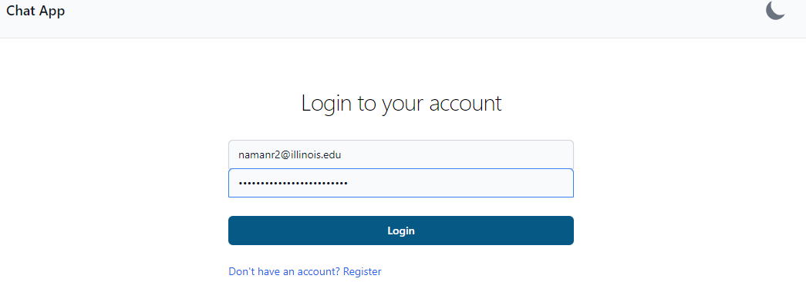
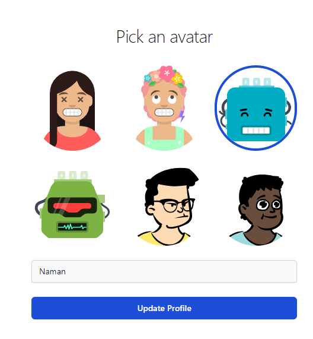
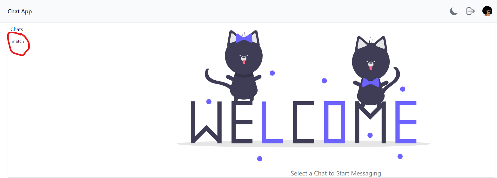
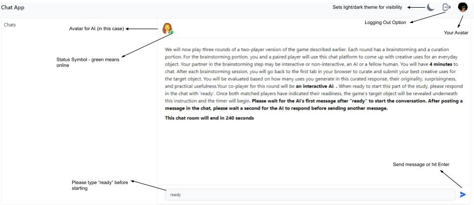

# An Experimental Testbed for Evaluating Co-Creativity in Human-Human and Human-AI Teams

*Developed by Babak Hemmatian, Yijun Lin, Shravan Ramamoorthy, Haotian Wang, and Naman Raina*

---

## Table of Contents

- [Introduction](#introduction)
- [How to Use](#how-to-instructions)
  - [Two-Computer Interaction](#two-computer-interaction)
  - [Single-Computer Interaction](#single-computer-interaction)
- [FAQs](#faqs)

---

## Introduction

We present a [new experiment platform]([https://co-creativity.onrender.com/](https://ai-co-leadership-1.onrender.com/)) to allow controlled study of human-AI and human-human teams during a co-strategizing task. Our platform allows co-players to interact during the ideation stage before choosing their personal responses during the curation step. Our original webapp allows identical procedures to be used for human-human and human-AI pairs and experimental controls to be applied to the chat. The results can be evaluated using the same procedures as in the standard individual tests of co-creation. We currently use GPT-5 as the AI agent, but the platform’s modularity allows us to replace it with more or less advanced algorithms as needed. Write to [Babak Hemmatian, Ph.D.](mailto:babak.hemmatian@stonybrook.edu) with any questions or concerns. 

**NOTE**: This repository uses the template from [this](https://github.com/BabakHemmatian/AI-creativity) testbed for co-creativity. More information about use and configurations can be found there.

## FAQs

### How do I match and chat?
1. Head over to the [chat app](https://aicreativity-frontend.onrender.com/).
2. You will be prompted to the following page:

   

     
      
     <em>Login Page for Chat App</em>
   

3. Enter your information (note that registration requires a password confirmation).
4. Choose an avatar and type in your name as shown below:

   

     
      
     <em>Enter Name & Choose Avatar</em>
   

5. You will see this screen (do refresh so that you can see the avatar on the top right). Click on "match".

   

     
      
     <em>Match Page</em>
   

   
7. You will be directed to the chat screen. Type "ready" to get started.

    

     
      
     <em>Chat Page</em>
   

   
### The chat app is unresponsive. What do I do?
Please refresh the page and the chat app will restart from the round you were currently in. If the problem persists, please log out and then log in again. 

### I want to provide feedback on the chat app. Who should I contact?
Please contact [Babak Hemmatian, Ph.D.](mailto:babak.hemmatian@stonybrook.edu).
